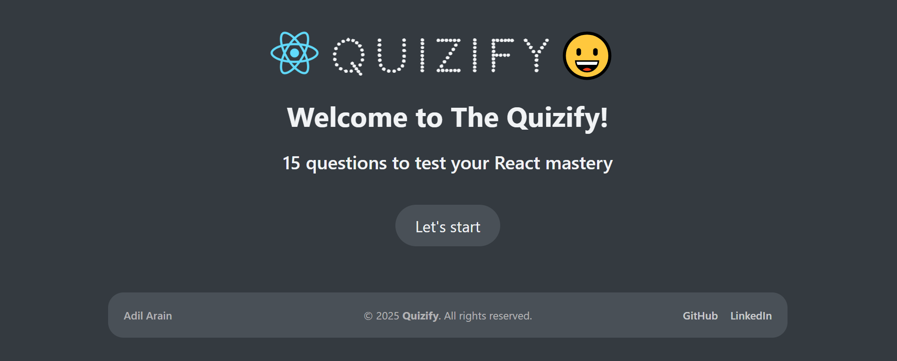

# React Quizify App

### Live Demo: https://react-quizify-app.vercel.app/

### Description:

The React Quizify App is designed to test users' knowledge of React.js through 15 multiple-choice questions (MCQs). It covers key concepts such as components, hooks, and state management, providing an engaging way for developers to assess their React mastery.

### Functionalities:

The app allows users to answer 15 MCQs and view their marks and score at the end. It calculates the score based on correct answers and displays feedback, making it a fun and informative tool for learning React.
