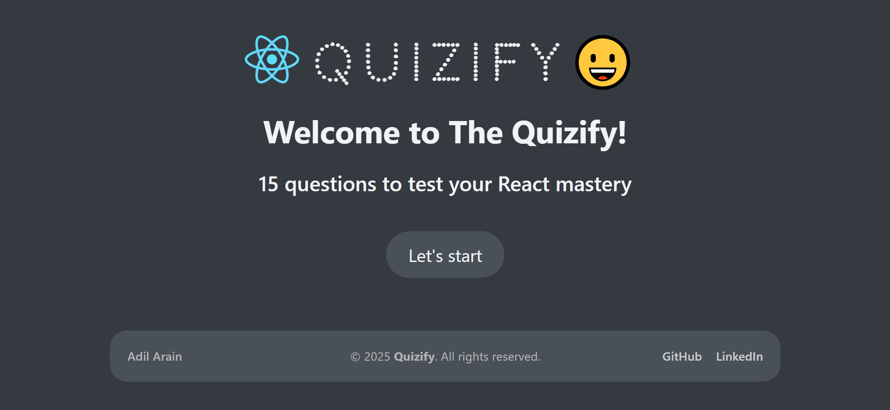

# 🧠 React Quizify App – Test Your React Knowledge

<!-- Add screenshots or a demo GIF here if available -->

## 📖 Description

**React Quizify** is an interactive quiz application built with **React.js**. It challenges users with 15 multiple-choice questions (MCQs) that cover essential React concepts such as components, hooks, state management, and more. Ideal for both beginners and intermediate developers, the app helps reinforce React fundamentals in a fun and engaging way.

At the end of the quiz, users receive a detailed score summary, helping them evaluate their performance and track their learning progress.

## 🧩 Features
- 🧾 15 randomized multiple-choice questions  
- ✅ Real-time score calculation and feedback  
- 🧠 Covers React hooks, components, state, and more  
- 🎯 Result display with correct answers and total score  
- ⚡ Smooth and responsive user experience  

## 🛠 Tech Stack
- **Frontend:** React, CSS Modules  
- **State Management:** useState, useReducer, Context API  
- **Other Tools:** useEffect, conditional rendering, prop drilling  
